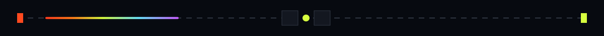
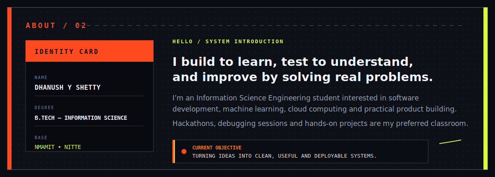
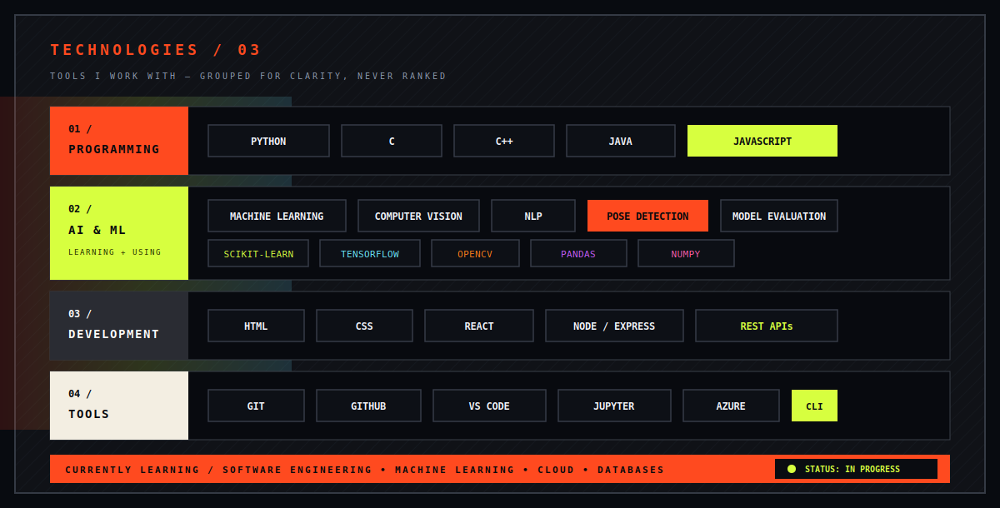
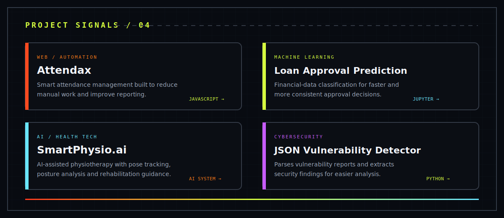
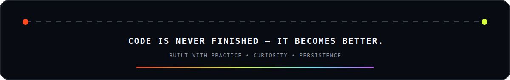

## ⚡ Field Notes

<table>
<tr>
<td width="50%" valign="top">

### Hack-Nocturne 2026 — SmartPhysio.ai

Built an AI-assisted physiotherapy concept during a 24-hour hackathon, with pose tracking, posture analysis, multi-joint feedback and a rehabilitation dashboard.

</td>
<td width="50%" valign="top">

### HackFest 2026 — Rapid Project Development

Worked under a 36-hour development window, contributing to core implementation, debugging, teamwork and rapid prototyping.

</td>
</tr>
<tr>
<td width="50%" valign="top">

### Microsoft Learn — Cloud Infrastructure

Studied cloud fundamentals, shared responsibility, Azure compute, storage, networking, RBAC, governance, Portal and CLI workflows.

</td>
<td width="50%" valign="top">

### Current Learning Queue

`Software Engineering` · `Machine Learning` · `Cloud Computing` · `Web Development` · `Database Management`

</td>
</tr>
</table>

## 📡 GitHub Telemetry

### Contribution Circuit

<picture>
  <source media="(prefers-color-scheme: dark)" srcset="https://raw.githubusercontent.com/dhanush229-lab/dhanush229-lab/output/github-contribution-grid-snake-dark.svg" />
  <source media="(prefers-color-scheme: light)" srcset="https://raw.githubusercontent.com/dhanush229-lab/dhanush229-lab/output/github-contribution-grid-snake.svg" />
  
</picture>

